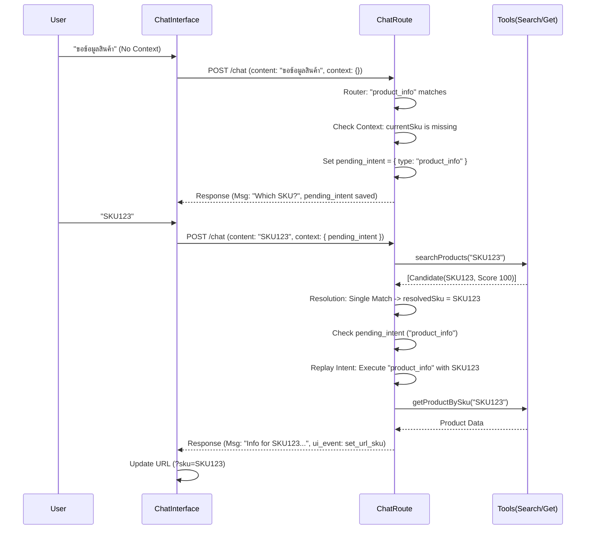
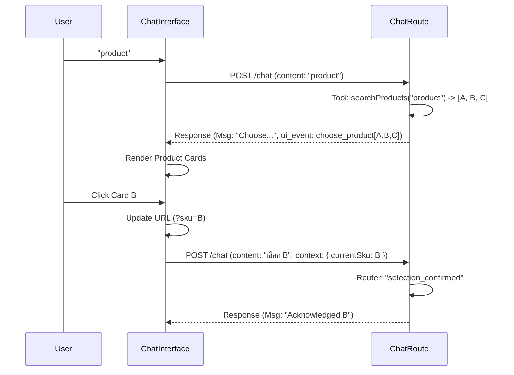
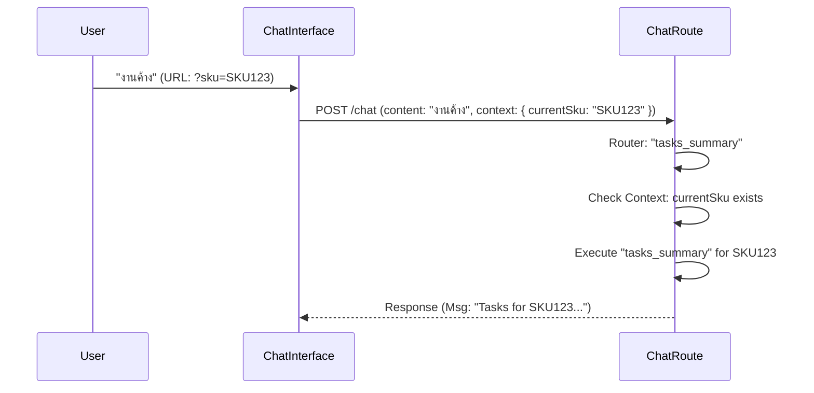

# System Overview: Chat-First Product Workflow

## 1. High-Level Architecture

The system implements a **Chat-First** workflow where users interact with a natural language interface to query product data, manage tasks, and access files. The core orchestration logic resides in the Next.js API route (`/api/workspace/chat`), which handles intent recognition, context management, and tool execution.

### Flow A: Ask Protocol (Missing Context -> Pending Intent -> Replay)

User asks for info without specifying a product. System captures intent, asks for clarification, and replays intent once SKU is provided.

### Flow B: Ambiguity Protocol (Ambiguous -> Choose UI -> Set Context -> Replay)

User query matches multiple products. System presents choice buttons.

### Flow C: Direct Protocol (SKU in URL -> Immediate Execution)

User already has context (e.g., from URL).

## 2. Components & Responsibilities

| Component | File Path | Responsibility |
|-----------|-----------|----------------|
| **Chat Interface** | `src/components/workspace/ChatInterface.tsx` | - Capture user input - Manage URL state (`?sku=`) - Render UI events (`choose_product`) - Construct API payload |
| **API Router** | `src/app/api/workspace/chat/route.ts` | - **Authentication**: Verify NextAuth session - **Context Injection**: Merge user/session data - **Router**: Regex-based intent matching - **Resolution**: Handle missing SKU / ambiguity - **Replay**: Execute pending intents |
| **Tools** | `src/lib/workspace/tools.ts` | - `searchProducts(query)`: Fuzzy search & scoring - `getProductBySku(sku)`: Fetch details - `getTasks(sku)`: Fetch tasks |
| **Orchestrator** | `src/lib/workspace/orchestrator-core.ts` | - (Legacy/Advanced) Multi-step agent planning (currently bypassed for direct commands) |
| **Google Sheets** | `src/lib/google/sheets.ts` | - Data persistence layer (Products, Tasks, Activity Log) |

## 3. Data Sources

The system relies on a Google Sheet as the primary database (acting as a CMS/ERP).

| Feature | Sheet Name | Description |
|---------|------------|-------------|
| **Product Resolution** | `products` | Columns: `sku_code`, `product_name`, `status`, `brand`, `price` |
| **Task Management** | `tasks` | Columns: `product_id`, `task_name`, `status`, `due_date` |
| **Attachments** | `attachments` | (Planned) Links to Drive files |
| **Sales Data** | `sales` | (Planned) Transaction records |

---
**Note**: All sensitive keys (`GOOGLE_SERVICE_ACCOUNT_EMAIL`, etc.) are managed via environment variables and are **not** exposed in the client bundle.
